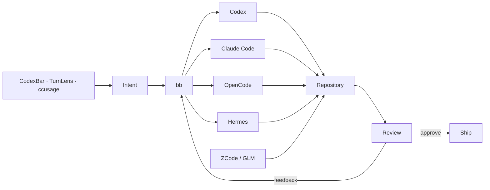

<div align="center">

# KRAKEN

### personal NixOS workstation

**NixOS · Hyprland · Caelestia · Ghostty · PychoVIM · Codex · Claude · OpenCode · Hermes**


</div>

---

This repository defines my daily NixOS workstation. It is built around one machine, one user and a fairly simple rule: important behavior should live in the config instead of in forgotten setup steps.

It is not meant to be a general-purpose NixOS framework. The config follows my own desktop, development and privacy preferences and is allowed to be opinionated.

## Philosophy

### Reproducible where it matters

NixOS and Home Manager own the stable system surface. Packages come from nixpkgs or maintained upstream flakes when possible. Custom packages are pinned to exact versions and hashes, and the important ones are built in CI.

A rebuild should not depend on remembering which installer was run or which checkbox was clicked months ago.

### Keep the desktop coherent

Hyprland is the compositor and Caelestia is the desktop shell. Caelestia owns the bar, launcher, control center, notifications, network/audio controls, clipboard UI, lock/idle flow and capture controls.

There is no second bar or parallel shell layer doing the same job. New desktop tools need a distinct reason to exist.

### Automate work, not judgment

Coding agents are part of the normal workflow, but they do not replace review. `bb` coordinates Codex, Claude Code, OpenCode and Hermes; Plannotator provides an explicit review surface; TurnLens, ccusage and CodexBar make usage visible.

The working loop is intentionally boring:

**delegate → inspect → review → ship**

### Privacy is a system property

Privacy is treated as part of the workstation rather than a separate "privacy mode". Tor, Session and Monero tooling are available when needed; Atuin history stays local; development services are not exposed to the network by default; blockchain nodes are not started automatically.

The influence from Monero here is mostly philosophical: reduce unnecessary trust, keep control with the user and do not trade privacy away by default. It is one part of the system, not the theme of the entire machine.

### Prefer explicit behavior

Services should run because they are useful, not because a package happened to be installed. Flake updates are explicit. Monero nodes are opt-in. The local web stack has explicit start/stop commands. The desktop command palette copies commands instead of executing them blindly.

The config should make the machine easier to reason about, not more magical.

## Stack

| Layer | Choice |
|---|---|
| OS | **NixOS unstable + Home Manager** |
| compositor | **Hyprland** with modular Lua config |
| desktop shell | **Caelestia / Quickshell** |
| terminal | **Ghostty** |
| shell | **Zsh + minimal Oh My Zsh + Starship** |
| editor | **PychoVIM** + **Zed Preview** |
| browsers | **Zen** + **Helium** + **Tor Browser** |
| agent control | **bb** |
| coding agents | **Codex · Claude Code · OpenCode · Hermes** |
| agent GUIs | **T3 Code · ZCode / GLM** |
| desktop AI | **ChatGPT Desktop · Claude Desktop** |
| command memory | **Navi · Atuin · command palette** |
| containers / VMs | **Podman · Distrobox · libvirt** |
| privacy tools | **Tor · Zapret2 · Monero tooling** |

## Desktop

```text
Hyprland
└── Caelestia
    ├── bar
    ├── launcher
    ├── control center
    ├── notifications + DND
    ├── Wi-Fi / Bluetooth / audio
    ├── lock + idle
    ├── clipboard frontend
    ├── screenshots / recording
    ├── wallpaper / Material palette
    └── CodexBar usage delegate
```

Hyprland is split into small Lua modules under `home/yargc/hypr/`:

```text
hyprland.lua
└── kraken/
    ├── appearance.lua
    ├── input.lua
    ├── autostart.lua
    └── binds.lua
```

Caelestia drives the dynamic desktop palette into GTK, Ghostty PTYs, Hyprland borders, Fuzzel-backed pickers, btop and nvtop. Apps with their own deliberate theme can keep it.

There is no Waybar, `nm-applet`, Blueman tray UI, separate Hyprland lock/idle stack or night-light daemon.

## Agent workflow



- **bb** — main multi-agent control plane.
- **T3 Code** — shared GUI surface for Codex, Claude and OpenCode.
- **ZCode** — GLM-focused coding environment.
- **Plannotator** — visual plan/review gate.
- **CodexBar** — provider quota and reset state inside Caelestia.
- **TurnLens** — per-turn Codex/Claude usage inspection.
- **ccusage** — broader historical usage accounting.

No local LLM runtime is enabled by default.

## Command memory

Rare commands should be searchable instead of memorized.

- `Super + /` opens the desktop command palette and copies the selected command.
- `Ctrl + G` opens Navi inside Zsh and inserts a command into the current prompt.
- `Ctrl + R` opens local Atuin history search.
- `Super + Shift + /` opens the searchable keybind sheet.

Curated commands live in `home/yargc/command-memory.nix`.

## Development

The workstation includes the toolchains I actually use:

**Git · gh · Rust · Go · Python/uv · Node 24 · Bun · TypeScript · PHP/Composer · Java 21 · Lua · nixd · GCC/Clang · CMake · GDB · Lazygit · mise**

Bun is the user-facing JavaScript package manager. Node stays installed for runtime and language-server compatibility.

The local web stack is Nix-native instead of XAMPP:

- Apache
- PHP
- MariaDB
- localhost-oriented defaults
- `web-start`, `web-stop`, `web-restart`, `web-status`

Podman, Distrobox and libvirt cover container and VM workflows.

## Privacy

The privacy layer is useful without turning the laptop into an always-on server.

- **Tor client** provides a local SOCKS endpoint for applications that explicitly support it.
- **Tor Browser** keeps its own browser/Tor integration separate from the system client.
- **Zapret2** uses a narrow TCP/443 TLS ClientHello baseline rather than processing everything.
- **Atuin** history stays local with sync disabled.
- **Session** is installed alongside Telegram for messaging.
- **Monero GUI / CLI**, **Feather**, **Eigenwallet** and **Cuprate** are available for Monero-related workflows.

Neither `monerod` nor `cuprated` is enabled as a background service. Node storage and bandwidth remain an explicit choice.

## Applications

- **Zen Browser** — daily browser.
- **Helium** — Chromium-side companion.
- **Tor Browser** — Tor browsing surface.
- **Ghostty** — terminal.
- **Thunar** — file manager.
- **ChatGPT Desktop / Claude Desktop** — native AI clients.
- **Vesktop + Vencord** — Discord.
- **Spotify + Spicetify-Nix** — music with Caelestia MPRIS integration.
- **Session / Telegram** — messaging.
- **Obsidian** — notes.
- **Bottles** — Windows application compatibility through the nixpkgs Wine/FHS stack.

Application self-updaters are disabled where Nix should own updates.

## Packaging policy

When adding software, use this order:

1. nixpkgs
2. official or maintained upstream flake
3. source derivation
4. pinned binary derivation when the earlier options are impractical

Custom binary packages must pin their source and hash. Important custom packages get dedicated CI builds.

Two user-space tools intentionally keep their upstream-managed workflow:

- **PSYCHOVIM** owns its mutable Neovim config and updater while Nix supplies dependencies.
- **Zed Preview** follows the official Preview installer because the desired Preview channel is not exposed as a dedicated flake package.

## Repository layout

```text
.
├── flake.nix
├── flake.lock
├── hosts/
│   └── kraken/
├── modules/
│   ├── core/
│   ├── desktop/
│   ├── development/
│   └── privacy/
└── home/
    └── yargc/
        ├── hypr/
        ├── packages/
        ├── command-memory.nix
        ├── privacy.nix
        ├── dev.nix
        └── ...
```

Home Manager runs as a NixOS module so the host and user environment evaluate together.

## Host

Current target: **Lenovo IdeaPad Gaming 3 16ARH7 (82SC)**

- Ryzen 5 6600H
- Radeon 660M iGPU
- RTX 3050 Mobile
- 1920×1200 / 165 Hz panel
- Btrfs NVMe storage

AMD drives the normal desktop. NVIDIA is available through PRIME offload when needed.

Hardware-specific assumptions stay in the host layer. Filesystem UUIDs, partition maps and hardware modules should never be copied from another machine.

## Installation note

> [!CAUTION]
> `hosts/kraken/hardware-configuration.nix` is a placeholder until the real NixOS installation generates one for this machine.

Before partitioning or bootloader changes, inspect the actual machine first (`lsblk -f`, UEFI state, existing partitions). The repository currently targets systemd-boot on UEFI.

Once the machine is running NixOS, normal maintenance is small:

```bash
nh os test
nh os switch
nh clean all --keep 5
```

Flake updates are explicit:

```bash
cd ~/nix-config
nix flake update
nh os switch
```

## Non-goals

This config is not trying to be a universal framework, a gaming distro, a local-AI cluster or an always-on homelab. It is a personal workstation config that should stay understandable as it grows.
