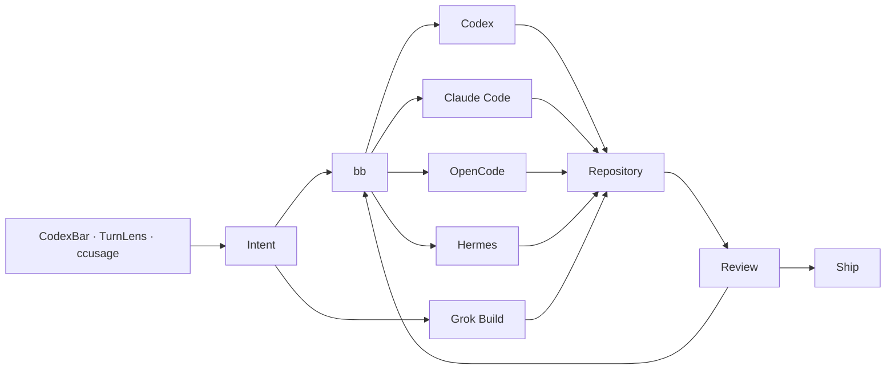

<div align="center">

# VESPER

### personal NixOS workstation

**NixOS · Hyprland · Caelestia · Ghostty · PychoVIM · Codex · Claude · OpenCode · Grok Build · Hermes**


</div>

Vesper is the configuration for `yargc@vesper`, a Lenovo IdeaPad Gaming 3 running NixOS unstable.

It is a personal config, not a framework. The point is to keep the machine reproducible without turning the desktop into a pile of overlapping utilities.

## Principles

- **Nix owns the stable system.** Prefer nixpkgs, then maintained upstream flakes, then pinned custom packaging.
- **One desktop shell.** Hyprland handles windows; Caelestia handles the bar, launcher, control center, notifications, lock/idle, clipboard and capture UI.
- **Agents stay reviewable.** Codex, Claude Code, OpenCode, Grok Build and Hermes can do the mechanical work; `bb`, Plannotator, TurnLens and CodexBar keep the workflow visible.
- **Privacy is normal configuration, not a special mode.** Tor and Monero tooling are available, Atuin stays local, and expensive background services are opt-in.
- **No duplicate surface for the same job.** A new daemon, tray app or launcher needs a reason to exist.

## Look

The desktop uses a restrained glass style: translucent Caelestia surfaces, stronger Hyprland blur, soft shadows, thin borders and rounded corners. The reference is modern glass UI, but readability wins over transparency.

The default wallpaper is the dark Dracula Nix wallpaper from the NixOS artwork package. A Solarized Dark Nix wallpaper is installed beside it and both appear in Caelestia's wallpaper picker. They come from nixpkgs; no generated wallpaper is stored in this repo.

The intended palette is cold and dark rather than neon-heavy: black, graphite, blue and muted violet. It works with the clean corporate/night-city mood without making the whole desktop a movie theme.

## Stack

| Layer | Choice |
|---|---|
| system | NixOS unstable + Home Manager |
| compositor | Hyprland, modular Lua config |
| shell | Caelestia / Quickshell |
| terminal | Ghostty |
| shell prompt | Zsh + minimal Oh My Zsh + Starship |
| editor | PychoVIM + Zed Preview |
| browsers | Zen + Helium + Tor Browser |
| coding agents | Codex · Claude Code · OpenCode · Grok Build · Hermes |
| agent control | bb |
| agent GUI | T3 Code Nightly |
| desktop AI | ChatGPT Desktop · Claude Desktop |
| command memory | Navi + local Atuin |
| media | Spotify + Spicetify · MPV + MPRIS |
| privacy | Tor · Zapret2 · Monero GUI/CLI · Feather · Eigenwallet · Cuprate |
| containers / VMs | Podman · Distrobox · libvirt · virt-manager |
| Windows compatibility | Bottles |

## Desktop

```text
Hyprland
└── Caelestia
    ├── bar + launcher
    ├── control center
    ├── notifications + DND
    ├── Wi-Fi / Bluetooth / audio
    ├── lock + idle
    ├── clipboard
    ├── screenshots / recording
    ├── wallpaper-driven palette
    └── CodexBar usage delegate
```

There is no Waybar, `nm-applet`, Blueman tray UI, parallel lock/idle stack or night-light daemon.

Useful keys:

| Key | Action |
|---|---|
| `Super + Space` | Caelestia launcher |
| `Super + C` | control center |
| `Super + /` | Vesper command palette |
| `Super + Shift + /` | keybind sheet |
| `Ctrl + G` | Navi into current prompt |
| `Ctrl + R` | Atuin history |
| `Super + A` | ChatGPT |
| `Super + Shift + A` | Claude Desktop |
| `Super + G` | Grok Build |
| `Super + Shift + D` | bb |
| `Super + T` | T3 Code Nightly |
| `Super + U` | CodexBar |

## Agent workflow



Grok Build is xAI's official terminal coding agent and is installed directly from nixpkgs as `pkgs.grok-build`. Its version follows the pinned nixpkgs input and changes through the normal flake update flow.

No local LLM runtime is enabled by default.

## Development

Toolchains:

**Git · gh · Rust · Go · Python/uv · Node 24 · Bun · TypeScript · PHP/Composer · Java 21 · Lua · nixd · GCC/Clang · CMake · GDB · Lazygit · mise**

Bun is the user-facing JavaScript package manager. Node stays for runtimes and language servers.

The local web stack is Nix-native:

- Apache
- PHP
- MariaDB
- localhost-oriented defaults
- `web-start`, `web-stop`, `web-restart`, `web-status`

## Media

Spotify remains the default streaming player through Spicetify and Caelestia MPRIS.

MPV is the local audio/video player. Home Manager configures PipeWire output, hardware decoding and the MPV MPRIS script, and common audio/video MIME types open in MPV by default. This keeps local playback integrated with the same desktop media controls instead of adding another standalone music shell.

## Privacy and Monero

Tor provides a system SOCKS endpoint for software that explicitly supports it. Tor Browser keeps its own Tor integration separate. Zapret2 is configured with a narrow TCP/443 baseline.

Monero is one part of the workstation, not its identity. The config includes Monero GUI/CLI, Feather, Eigenwallet and the experimental Rust node implementation Cuprate. Neither `monerod` nor `cuprated` starts automatically.

The underlying rule is simple: reduce unnecessary trust, keep fund-moving software sourced carefully, and do not start storage/bandwidth-heavy services without asking.

## Applications

- Zen Browser
- Helium
- Tor Browser
- ChatGPT Desktop
- Claude Desktop
- Vesktop + system Vencord
- Spotify + Spicetify-Nix
- MPV + MPRIS
- Session
- Telegram
- Obsidian
- Thunar
- Bottles
- T3 Code Nightly
- Grok Build

ZCode is intentionally not part of Vesper.

## Packaging

Preference order:

1. nixpkgs
2. official/upstream flake
3. pinned source derivation
4. pinned binary derivation when there is no better option

T3 Code Nightly uses an official pinned upstream AppImage because nixpkgs tracks the stable channel rather than the requested nightly channel.

Current intentional mutable exceptions are PychoVIM's upstream-managed config and Zed Preview's official Preview installer.

## Layout

```text
.
├── flake.nix
├── flake.lock
├── hosts/
│   └── vesper/
├── modules/
│   ├── core/
│   ├── desktop/
│   ├── development/
│   └── privacy/
└── home/yargc/
    ├── hypr/
    ├── packages/
    ├── command-memory.nix
    ├── caelestia.nix
    ├── dev.nix
    └── privacy.nix
```

## Host

`vesper` targets a Lenovo IdeaPad Gaming 3 16ARH7 (82SC):

- Ryzen 5 6600H
- Radeon 660M iGPU
- RTX 3050 Mobile
- 1920×1200 / 165 Hz panel
- Btrfs NVMe storage

AMD drives the desktop. NVIDIA is PRIME offload only.

> [!CAUTION]
> `hosts/vesper/hardware-configuration.nix` is a placeholder until the real NixOS installer generates one on this machine. Do not invent filesystem UUIDs or copy another machine's hardware configuration.

The repository targets systemd-boot on UEFI. Before installation or partition changes, verify the actual disk layout with `lsblk -f` and confirm the boot mode.

Once the machine is on NixOS:

```bash
nh os test
nh os switch
nh clean all --keep 5
```

Flake updates remain explicit:

```bash
cd ~/nix-config
nix flake update
nh os switch
```
