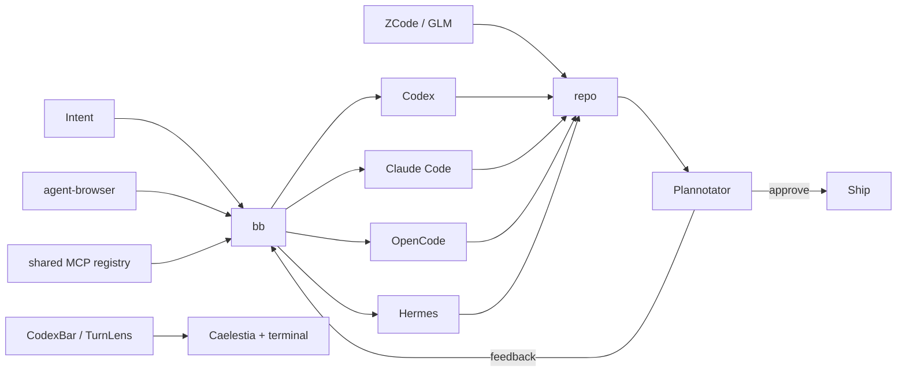

<div align="center">

# KRAKEN

### an agentic NixOS rice

**Hyprland · Caelestia · bb · Codex · Claude · OpenCode · Hermes · GLM**

A Linux workstation built around a simple loop:
**delegate → inspect → review → ship.**


</div>

---

Kraken is my daily NixOS workstation: a Hyprland rice where coding agents are part of the desktop instead of a pile of forgotten terminal tabs.

The rule is simple: **use cloud/provider agents where they are useful, keep the machine itself light, and let one shell own the desktop.** There is no Ollama stack, local-model daemon or pile of overlapping panels here.

## Desktop

| Layer | Choice |
|---|---|
| compositor | **Hyprland**, modular Lua config |
| shell | **Caelestia / Quickshell**, patched by Nix |
| terminal | **Ghostty** |
| shell UX | **Zsh + minimal Oh My Zsh + Starship** |
| editor | **PychoVIM** + **Zed Preview** |
| browser | **Zen** + **Helium** + **Tor Browser** |
| music | **Spotify + Spicetify** |
| Discord | **Vesktop + system Vencord** |
| privacy | **Tor client + Zapret2 + Monero + Eigenwallet** |
| desktop AI | **ChatGPT Desktop** + **Claude Desktop** |
| agent IDEs | **bb** + **T3 Code** + **ZCode** |

## One desktop shell

Caelestia owns the bar, launcher, control center, network/Bluetooth/audio controls, notification history, DND, idle/lock flow, clipboard frontend, screenshots/recording and wallpaper scheme. The remaining `cliphist` watchers are only its history backend.

Wallpaper changes drive Caelestia's Material scheme into the shell, GTK apps, Fuzzel-backed pickers, btop/nvtop, Hyprland borders and terminal PTYs. Spotify stays on its deliberate Catppuccin theme instead of being rewritten by the wallpaper engine.

Hyprland itself is split into small Lua modules under `home/yargc/hypr/`: appearance, input, autostart and binds. No legacy `hyprland.conf`, parallel `hypridle`, `nm-applet`, Blueman or second bar.

## Agent workflow



### The useful surfaces

- **bb** — primary control plane for Codex, Claude Code, OpenCode and Hermes threads/worktrees.
- **T3 Code** — lightweight GUI with Codex, Claude and OpenCode enabled together.
- **ZCode** — GLM-focused agentic development environment, packaged from Z.AI's Linux artifact and pinned by hash.
- **Plannotator** — visual review gate for Codex and Claude plans.
- **agent-browser** — browser automation without turning the desktop into a local-model lab.
- **CodexBar** — provider quota/reset state integrated directly into Caelestia.
- **TurnLens** — pinned local CLI for per-turn Codex/Claude token usage, reasoning/tool-call context and API-equivalent cost.
- **ccusage** — broader historical cloud-agent accounting; it complements rather than replaces TurnLens.

## Caelestia × CodexBar

Kraken does not start a second bar just for AI usage. Caelestia is patched during the Nix build with a native `aiUsage` QML delegate. CodexBar refreshes provider pressure every 30 seconds; clicking it opens the Wayland GTK provider panel.

```text
╭─────────────╮
│    logo     │
│ workspaces  │
│ active app  │
│    tray     │
│   🤖 34%   ├──── click ──── CodexBar panel
│    clock    │
│   status    │
│    power    │
╰─────────────╯
```

## Shell

Oh My Zsh is intentionally small: `git`, `sudo`, `extract` and `colored-man-pages`. Completion, autosuggestions, syntax highlighting and history search remain Home Manager-managed, while Starship owns the prompt.

Caelestia also writes the active Material terminal palette as ANSI sequences; Zsh reapplies the latest palette when a new Ghostty shell starts.

## Command memory

Kraken does not expect rarely used commands to be memorized or buried in a notes app.

- `Super + /` opens **Kraken Commands**, a Navi-backed searchable palette of curated commands. A selection is copied to the clipboard instead of being executed blindly from a launcher.
- `Ctrl + G` opens Navi inside Zsh and inserts the chosen command into the current prompt, where it can be reviewed or edited before running.
- `Ctrl + R` opens **Atuin** fuzzy history search. It stays local on this machine: sync and update checks are disabled.
- `Super + Shift + /` opens the separate searchable keybind cheatsheet.

The curated commands live declaratively in `home/yargc/command-memory.nix`, so agent commands, Nix maintenance, the local web stack, Git/GitHub and Monero tooling have one source of truth. **Kraken Commands** also appears in Caelestia's normal app launcher through its desktop entry.

## Privacy / Monero

Kraken keeps privacy tooling available without turning it into an always-on homelab.

- **Zapret2** is enabled through the native NixOS module. Only TLS ClientHello traffic on TCP/443 is sent through its NFQUEUE path, with persistent host autodetection so the bypass stays targeted.
- A **system Tor client** provides a stable local SOCKS endpoint at `127.0.0.1:9050` for applications that support proxies directly. Tor Browser stays separate and keeps its own bundled Tor process.
- **Monero GUI** is the reference graphical wallet.
- **Monero CLI** provides `monerod`, `monero-wallet-cli` and `monero-wallet-rpc` for advanced use and native SOCKS5 workflows.
- **Feather** is installed as the lightweight desktop alternative with integrated Tor support.
- **Eigenwallet** comes directly from nixpkgs and provides the BTC ↔ XMR atomic-swap desktop workflow.
- **Cuprate / `cuprated`** is the Rust alternative Monero node implementation. The pinned preview binary is available for testing without replacing `monerod`.

Neither `monerod` nor `cuprated` is enabled as a background service by default. Running a full/pruned node is deliberately opt-in so a normal desktop rebuild does not silently commit large amounts of storage and bandwidth.

## Music

Spotify is managed through **Spicetify-Nix** with `adblockify`, `hidePodcasts`, `shuffle` and Catppuccin Mocha. Music controls stay inside Caelestia's MPRIS layer so the dashboard, Now Playing UI and hardware media keys agree on the same session.

> Spicetify and its extensions are community modifications and can break when Spotify changes its client.

## Discord

Discord runs through **Vesktop with Nix-managed Vencord** rather than patching the stock client after every rebuild. App self-updates are disabled and the Caelestia tray handles the desktop integration.

> Vesktop/Vencord are unofficial Discord client modifications and may conflict with Discord's Terms of Service.

## Shortcuts

| Key | Action |
|---|---|
| `Super + Space` | Caelestia launcher |
| `Super + C` | control center / quick toggles |
| `Super + Shift + N` | notification sidebar/history |
| `Super + Shift + V` | clipboard history |
| `Super + .` | emoji picker |
| `Super + /` | **Kraken Commands** palette |
| `Super + Shift + /` | searchable keybind cheatsheet |
| `Ctrl + G` | Navi command cheatsheet → current Zsh prompt |
| `Ctrl + R` | Atuin fuzzy shell history |
| `Super + Shift + Space` | switch keyboard layout |
| `Alt + Tab` | cycle windows |
| `Print` | screenshot |
| `Shift + Print` | frozen region screenshot |
| `Super + Ctrl + O` | OCR selected region to clipboard (Turkish + English) |
| `Super + Shift + R` | region recording |
| `Super + L` | Caelestia lock |
| `Super + M` | Spotify |
| `Super + D` | Vesktop / Discord |
| `Super + Shift + D` | **bb** agent IDE |
| `Super + T` | T3 Code |
| `Super + Shift + G` | **ZCode / GLM** |
| `Super + Shift + H` | Hermes Desktop |
| `Super + U` | CodexBar provider panel |
| `Super + Shift + C` | Codex in Ghostty |
| `Super + Shift + O` | OpenCode in Ghostty |
| `Super + A` | ChatGPT Desktop |
| `Super + Shift + A` | Claude Desktop |
| `Super + N` | PychoVIM |
| `Super + Z` | Zed Preview |
| `Super + B` | Zen Browser |
| `Super + Shift + B` | Helium |

A three-finger horizontal touchpad gesture changes workspaces. `Super + mouse wheel` does the same. Commands and keybinds both have searchable surfaces, so the README is not required knowledge.

## Development baseline

**Git · gh · Rust · Go · Python/uv · Node 24 · Bun · TypeScript · PHP/Composer · Java 21 · Lua · nixd · GCC/Clang · Podman · Distrobox · libvirt · Lazygit · mise**

**Bun is the JS package-manager baseline.** Node remains for runtime/LSP compatibility. A Nix-native Apache + PHP + MariaDB stack replaces XAMPP and binds Apache to localhost only; shell controls are named `web-start`, `web-stop`, `web-restart` and `web-status` accordingly.

## Nix layout

```text
NixOS
├── Hyprland
│   └── Lua → appearance / input / autostart / binds
├── Caelestia
│   ├── desktop controls + idle/lock + capture
│   ├── wallpaper-driven theme propagation
│   └── CodexBar QML integration
├── command memory
│   ├── Navi → curated commands / Ctrl-G widget
│   └── Atuin → local Ctrl-R history
├── privacy
│   ├── Tor client + Zapret2
│   └── Monero GUI / CLI + Feather + Eigenwallet + Cuprate
├── desktop
│   ├── Zen + Helium
│   ├── Vesktop + Vencord
│   ├── ChatGPT + Claude
│   └── Spotify + Spicetify
├── agents
│   ├── bb → Codex / Claude / OpenCode / Hermes
│   ├── T3 Code
│   ├── ZCode / GLM
│   ├── TurnLens + ccusage
│   ├── Plannotator
│   └── agent-browser
└── host
    └── kraken
```

Most of the system is declarative. Two fast-moving user tools intentionally keep their upstream workflow:

- **PSYCHOVIM** owns its mutable Neovim config, marketplace and updater.
- **Zed Preview** follows the upstream Preview channel installer.

## Host

`kraken` is a Lenovo IdeaPad Gaming 3 16ARH7 with a Ryzen 5 6600H, Radeon 660M and RTX 3050 Mobile. AMD drives the desktop; NVIDIA is available through PRIME offload.

Night light is handled by `hyprsunset`: neutral from 07:00 and a mild 5000 K profile from 21:00.

## Install note

> [!IMPORTANT]
> `hosts/kraken/hardware-configuration.nix` is intentionally a placeholder. Never reuse another machine's filesystem UUIDs.

After NixOS generates the real hardware configuration:

```bash
git clone git@github.com:OnurByte/nix-config.git ~/nix-config
cd ~/nix-config
sudo cp /etc/nixos/hardware-configuration.nix hosts/kraken/hardware-configuration.nix
sudo nixos-rebuild test --flake .#kraken
sudo nixos-rebuild switch --flake .#kraken
```

---

<div align="center">

**delegate fast · review visually · keep the desktop simple**

</div>
