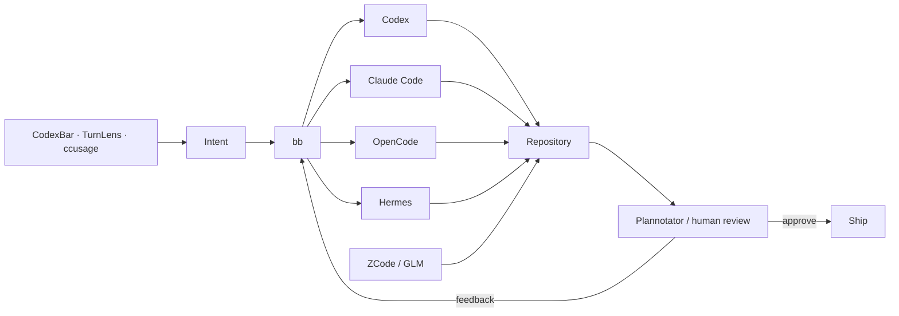

<div align="center">

# KRAKEN

### sovereign, agentic NixOS workstation

**NixOS · Hyprland · Caelestia · Monero · Codex · Claude · OpenCode · Hermes**

*A personal workstation built to be inspectable, reproducible, private where it matters, and fast to operate.*


</div>

---

Kraken is not a generic NixOS starter and it is not a package dump. It is the source code for one workstation: `yargc@kraken`.

The goal is to make the machine feel personal without making it fragile. The desktop should be beautiful without needing five overlapping shell layers. Development tools should be powerful without turning the host into a permanent background-service farm. AI agents should remove mechanical work without becoming an opaque operator of the machine. Privacy should be a property of the architecture, not a browser extension installed as an afterthought.

## Philosophy

### Own the machine

The configuration should be understandable, recoverable and rebuildable by its user.

NixOS and Home Manager own the stable system surface. Packages are taken from nixpkgs or upstream flakes when possible. Custom packages are pinned to exact sources and hashes, and important custom builds are exercised in CI. Random install scripts, floating `latest` artifacts and hidden state are avoided unless an upstream-managed mutable workflow is a deliberate choice.

The machine should never require remembering what was clicked in a settings window six months ago in order to reproduce its essential behavior.

### Privacy is autonomy

Kraken is strongly influenced by the values that make **Monero** important to me: privacy, fungibility, censorship resistance, decentralization, self-custody and minimizing unnecessary trust.

That does **not** mean pretending a desktop can become private merely by routing everything through Tor. Kraken still uses normal web services and cloud AI products when they are useful. The principle is narrower and more practical: the user should decide what runs, what leaves the machine, what stays local and which third party is being trusted.

That philosophy appears throughout the config:

- Tor exists as a first-class system capability instead of an emergency add-on.
- Monero tooling is available without silently starting a blockchain node in the background.
- `monerod` and Rust-based `cuprated` are opt-in, not ambient services.
- Feather, Monero GUI/CLI and Eigenwallet are installed from controlled package sources.
- Atuin history remains local; sync is disabled.
- agent usage and quota pressure are surfaced instead of hidden.
- services are not opened to the network merely because a development package was installed.
- secrets do not belong in the public Nix store.

Kraken is **not affiliated with or endorsed by the Monero project**. It simply shares a preference for user sovereignty over invisible convenience.

### Agents are tools, not authority

The agent loop is:

**delegate → inspect → review → ship**

Codex, Claude Code, OpenCode and Hermes can perform large amounts of mechanical work, but the workstation is designed to keep their actions visible. `bb` is the main multi-agent control plane, Plannotator provides a visual review gate, TurnLens exposes per-turn token/cost behavior, and CodexBar exposes provider quota/reset pressure.

The point is not maximum automation. The point is **maximum leverage without surrendering understanding**.

### One job, one surface

A rice gets worse when every new feature brings another bar, launcher, notification daemon and tray app.

Caelestia owns the desktop shell: bar, launcher, control center, Wi-Fi/Bluetooth/audio surfaces, notifications, DND, lock/idle flow, clipboard UI, capture controls and wallpaper-driven theming. Hyprland owns composition and window behavior. Ghostty owns the terminal. Navi and Atuin solve command memory. There is no second bar competing with Caelestia and no parallel desktop shell pretending to be integration.

### Explicit beats magical

Kraken prefers an explicit command over an invisible daemon when the daemon provides little daily value.

A Monero node does not start just because `monerod` exists. Cuprate does not replace the reference daemon behind the user's back. Flake inputs are not silently updated. The local web stack is controlled explicitly. Commands selected from the desktop command palette are copied rather than executed blindly.

The machine should surprise its owner as little as possible.

## The workstation

| Layer | Choice |
|---|---|
| OS | **NixOS unstable + Home Manager** |
| compositor | **Hyprland**, modular Lua config |
| desktop shell | **Caelestia / Quickshell** |
| terminal | **Ghostty** |
| shell | **Zsh + minimal Oh My Zsh + Starship** |
| editor | **PychoVIM** + **Zed Preview** |
| browsers | **Zen** + **Helium** + **Tor Browser** |
| agent control | **bb** |
| coding agents | **Codex · Claude Code · OpenCode · Hermes** |
| agent GUIs | **T3 Code · ZCode / GLM** |
| desktop AI | **ChatGPT Desktop · Claude Desktop** |
| privacy | **Tor · Zapret2 · Monero stack** |
| containers | **Podman · Distrobox · libvirt** |
| command memory | **Navi · Atuin · Kraken Commands** |

## Desktop architecture

```text
Hyprland
└── Caelestia
    ├── bar
    ├── launcher
    ├── control center
    ├── notifications + DND
    ├── Wi-Fi / Bluetooth / audio
    ├── lock + idle
    ├── clipboard frontend
    ├── screenshots / recording
    ├── wallpaper / Material palette
    └── CodexBar usage delegate
```

Hyprland configuration is split into small Lua modules under `home/yargc/hypr/`:

```text
hyprland.lua
└── kraken/
    ├── appearance.lua
    ├── input.lua
    ├── autostart.lua
    └── binds.lua
```

There is no Waybar, `nm-applet`, Blueman tray UI, parallel lock/idle stack or night-light daemon. Caelestia is the shell rather than decoration layered on top of another shell.

Wallpaper changes propagate the active Material palette into the surfaces where dynamic theming is useful: Caelestia, GTK, Ghostty PTYs, Hyprland borders, Fuzzel-backed pickers, btop and nvtop. Apps with deliberate themes, such as Spotify, are allowed to keep them.

## Agentic workflow



The main surfaces have intentionally different jobs:

- **bb** coordinates agent threads/worktrees and is the primary control plane.
- **T3 Code** gives Codex, Claude and OpenCode a shared graphical coding surface.
- **ZCode** provides the GLM-focused desktop agent environment.
- **Plannotator** turns agent planning into an explicit review step.
- **CodexBar** exposes quotas and reset pressure through Caelestia rather than another bar.
- **TurnLens** measures individual Codex/Claude turns from their transcripts.
- **ccusage** remains useful for broader historical usage accounting.

No local LLM runtime is enabled by default. Kraken is not an Ollama/LM Studio box unless that becomes an intentional future requirement.

## Command memory

A workstation full of powerful CLI tools is useless if their syntax lives in forgotten notes.

Kraken therefore treats command discovery as part of the desktop:

- `Super + /` — open **Kraken Commands**, search curated Navi cheatsheets and copy the selected command.
- `Ctrl + G` — open Navi inside Zsh and insert a selected command into the current prompt for review/editing.
- `Ctrl + R` — search local shell history with Atuin.
- `Super + Shift + /` — searchable keybind cheatsheet.

The curated command source lives in `home/yargc/command-memory.nix`. Agent tooling, Nix maintenance, Git/GitHub, the local web stack and Monero commands therefore have one declarative home instead of being spread across README snippets and random notes.

## Privacy and Monero

Privacy tooling is first-class, but expensive background behavior remains opt-in.

### Network/privacy layer

- **Tor client** provides a stable local SOCKS endpoint at `127.0.0.1:9050` for software that explicitly supports it.
- **Tor Browser** remains isolated from the system Tor client and uses its own intended browser/Tor integration.
- **Zapret2** is enabled through its NixOS module with a deliberately narrow TCP/443 TLS ClientHello baseline rather than indiscriminately processing all traffic.

### Monero layer

- **Monero GUI** — reference graphical wallet.
- **Monero CLI** — `monerod`, `monero-wallet-cli`, `monero-wallet-rpc` and advanced workflows.
- **Feather** — lightweight privacy-focused Monero desktop wallet with Tor support.
- **Cuprate / `cuprated`** — Rust alternative Monero node implementation, currently treated as an opt-in preview tool.
- **Eigenwallet** — BTC ↔ XMR atomic-swap desktop workflow from nixpkgs.

Neither `monerod` nor `cuprated` is enabled as a system service. Installing a node implementation must not silently consume hundreds of gigabytes of storage or persistent bandwidth.

For software that can move funds, package provenance matters more than convenience: prefer nixpkgs or official/upstream Nix packaging; when a custom package is unavoidable, pin the exact artifact and cryptographic hash and build-test it in CI.

## Development environment

The base workstation carries the toolchains needed for normal full-stack and systems work:

**Git · gh · Rust · Go · Python/uv · Node 24 · Bun · TypeScript · PHP/Composer · Java 21 · Lua · nixd · GCC/Clang · CMake · GDB · Lazygit · mise**

**Bun is the JavaScript package-manager baseline.** Node remains because runtimes, language servers and third-party tooling still depend on it.

The web stack is Nix-native rather than XAMPP:

- Apache
- PHP
- MariaDB
- localhost-oriented development defaults
- `web-start`, `web-stop`, `web-restart`, `web-status`

Podman, Distrobox and libvirt cover isolated/container/VM workflows without making Docker Desktop part of the workstation model.

## Applications

The desktop deliberately keeps rich native/GUI surfaces where they are better than another terminal wrapper:

- **Zen Browser** — daily browser.
- **Helium** — Chromium-side companion.
- **Tor Browser** — anonymity-oriented browsing surface.
- **ChatGPT Desktop / Claude Desktop** — native AI product surfaces.
- **Vesktop + system Vencord** — Discord client integration managed by Nix.
- **Spotify + Spicetify-Nix** — music with Caelestia MPRIS integration.
- **Session / Telegram** — messaging.
- **Obsidian** — notes/knowledge.
- **Thunar** — file manager.
- **Bottles** — opt-in Windows application compatibility through the nixpkgs Wine/FHS stack; it does not turn Kraken into a gaming distribution.

Application self-updaters are disabled where Nix should own updates.

## Packaging policy

When adding software, the preference order is:

1. **nixpkgs**
2. **official/upstream flake**
3. **source derivation**
4. **pinned binary derivation** only when the earlier options are impractical

Binary packages must pin exact versions/URLs and hashes. Important custom packages get dedicated CI builds.

There are intentional exceptions for fast-moving user-space workflows:

- **PSYCHOVIM** owns its mutable Neovim configuration and updater while Nix supplies its dependencies.
- **Zed Preview** follows the official Preview installer because the desired upstream Preview channel is not represented by a dedicated flake output.

An exception should remain an exception, not become the default installation method.

## Repository layout

```text
.
├── flake.nix
├── flake.lock
├── hosts/
│   └── kraken/
├── modules/
│   ├── core/
│   ├── desktop/
│   ├── development/
│   └── privacy/
└── home/
    └── yargc/
        ├── hypr/
        ├── packages/
        ├── command-memory.nix
        ├── privacy.nix
        ├── dev.nix
        └── ...
```

Home Manager is loaded as a NixOS module so the host and user environment evaluate as one system.

## Host: `kraken`

The target machine is a **Lenovo IdeaPad Gaming 3 16ARH7 (82SC)**:

- Ryzen 5 6600H
- Radeon 660M iGPU
- RTX 3050 Mobile
- 1920×1200 / 165 Hz panel
- Btrfs NVMe storage

AMD drives the normal desktop. NVIDIA is available through PRIME offload when an application actually needs it.

Hardware-specific configuration belongs in the host layer. Another machine's filesystem UUIDs, partition map, GPU assumptions or vendor modules must never be copied merely because the rest of the rice looks good.

## Important installation note

> [!CAUTION]
> `hosts/kraken/hardware-configuration.nix` is a placeholder until the real NixOS installation generates one for this machine. Do not invent UUIDs and do not copy somebody else's hardware configuration.

The intended migration is from the NixOS installer environment: mount the target filesystems, generate the hardware configuration for the mounted system, place this repo/config on the target, then build/install `.#kraken`.

Before any destructive partitioning or bootloader work, verify the actual machine with commands such as `lsblk -f` and confirm UEFI/boot assumptions. The repository currently targets systemd-boot on UEFI.

Once running on NixOS, normal maintenance is intentionally small:

```bash
nh os test
nh os switch
nh clean all --keep 5
```

Flake updates are explicit:

```bash
cd ~/nix-config
nix flake update
nh os switch
```

## Non-goals

Kraken is deliberately **not** trying to be:

- a universal NixOS framework for every machine;
- a self-hosted AI cluster;
- an always-on Monero node by default;
- a gaming distribution;
- a collection of every fashionable Wayland utility;
- a desktop where three launchers and two bars solve the same problem;
- a system whose important state only exists outside Git.

It is one opinionated workstation that should become easier to understand as it grows, not harder.

---

<div align="center">

### user sovereignty over invisible convenience

**declare what matters · expose what costs · minimize trust · review before ship**

</div>
