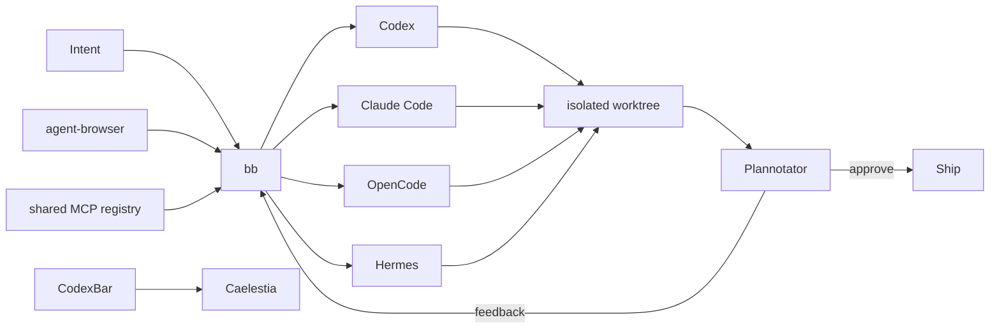

<div align="center">

# KRAKEN

### an agentic NixOS rice

**Hyprland · Caelestia · bb · Codex · Claude · OpenCode · Hermes**

A Linux workstation built around the loop that actually matters:
**ask → delegate → inspect → review → ship.**


</div>

---

## Why Kraken exists

Most "AI dev setups" are a normal desktop with a pile of agent CLIs installed on top. Kraken treats agents as part of the desktop itself.

- **One control plane for coding agents.** bb owns threads, worktrees and multi-agent orchestration instead of scattering work across terminals.
- **Quota state belongs in the shell.** CodexBar is rendered directly inside Caelestia.
- **Plans should be reviewed visually.** Codex and Claude Code are wired to Plannotator before plan-mode work continues.
- **GUI for context, terminal for speed.** T3 Code and bb sit beside direct Codex/OpenCode shortcuts.
- **The AI layer stays reproducible.** Apps, hooks, browser automation and agent tooling are pinned by Nix and `flake.lock`.

The point is not to put AI everywhere. It is to make delegation feel native without giving up control of the machine.

## Desktop

| Layer | Choice |
|---|---|
| compositor | **Hyprland** |
| shell | **Caelestia / Quickshell**, patched by Nix |
| terminal | **Ghostty** |
| editor | **PychoVIM** + **Zed Preview** |
| browser | **Zen** + **Helium** + **Tor Browser** |
| desktop AI | **ChatGPT Linux beta** + **Claude Desktop Linux beta** |
| keyboard | **Turkish Q only** |

## Agent workflow



## Agent surfaces

Kraken keeps the default set intentionally focused:

| Surface | Role |
|---|---|
| **bb** | Primary local-first Agent IDE. Codex, Claude Code, OpenCode and Hermes share one thread/worktree/automation UI. |
| **T3 Code** | Lightweight coding-agent GUI with Codex, Claude and OpenCode enabled together. |
| **AionUI** | General assistant/cowork desktop and WebUI for tasks that are not just repo coding. |
| **Hermes Desktop** | Native desktop surface for Hermes Agent. |
| **Hermes HUD** | Optional live Hermes activity TUI. |
| **agent-browser** | Chromium automation surface packaged for agent use. |
| **Plannotator** | Visual plan/diff review; annotations are sent back to the agent. |
| **CodexBar** | Provider quota, reset windows, credits and status. |
| **ccusage** | Local token/session/cost accounting. |

The fast-moving agent packages come from [`numtide/llm-agents.nix`](https://github.com/numtide/llm-agents.nix). Numtide's binary cache is enabled so this does not turn every rebuild into a local Electron/Rust compilation marathon.

### Visual plan review

Plannotator is integrated into **Codex and Claude Code** through Home Manager rather than an installer mutating dotfiles.

```text
Codex / Claude plan
        │
        ▼
 lifecycle hook
        │
        ▼
 Plannotator review UI
        │
   ┌────┴─────┐
 approve   annotate
   │           │
   ▼           ▼
 ship      feedback → agent
```

Codex uses its `Stop` hook. Claude Code mirrors Plannotator's upstream `EnterPlanMode` / `ExitPlanMode` flow.

## Caelestia × CodexBar

Kraken does **not** start Waybar just to get an AI quota widget.

The Caelestia package is patched during the Nix build with a native `aiUsage` QML delegate. It polls the CodexBar Linux CLI and renders the current provider pressure directly in Caelestia's existing vertical bar.

```text
╭─────────────╮
│    logo     │
│ workspaces  │
│             │
│ active app  │
│             │
│    tray     │
│             │
│   🤖 34%   ├──────── click ────────╮
│             │                       │
│    00:42    │                ╭──────▼──────────────╮
│   status    │                │ CodexBar GTK4 panel │
│    power    │                │ Codex      34%      │
╰─────────────╯                │ Claude     12%      │
                               │ resets · credits    │
                               │ cost · provider info│
                               ╰─────────────────────╯
```

- refresh every 30 seconds
- left click → GTK4 provider panel
- right click → immediate refresh
- no Waybar process
- no Arch/AUR dependency
- no copied `~/.config/waybar` scripts

The integration lives entirely in the configuration:

```text
home/yargc/caelestia.nix
home/yargc/packages/CodexUsage.qml
home/yargc/packages/caelestia-codexbar.patch
home/yargc/packages/codexbar-ui.nix
```

## Shortcuts

| Key | Action |
|---|---|
| `Super + Space` | Caelestia launcher |
| `Super + Shift + D` | **bb** agent IDE |
| `Super + T` | T3 Code |
| `Super + Shift + G` | AionUI |
| `Super + Shift + H` | Hermes Desktop |
| `Super + U` | CodexBar provider panel |
| `Super + Shift + C` | Codex in Ghostty |
| `Super + Shift + O` | OpenCode in Ghostty |
| `Super + A` | ChatGPT Desktop |
| `Super + Shift + A` | Claude Desktop |
| `Super + N` | PychoVIM |
| `Super + Z` | Zed Preview |
| `Super + B` | Zen Browser |
| `Super + Shift + B` | Helium |

Everything is also discoverable from the Caelestia launcher; keybinds are accelerators, not required tribal knowledge.

## Nix architecture

```text
NixOS
├── shell
│   └── Caelestia + native CodexBar QML patch
├── orchestration
│   └── bb → Codex / Claude / OpenCode / Hermes
├── lightweight GUI
│   ├── T3 Code
│   ├── AionUI
│   └── Hermes Desktop
├── control + review
│   ├── Plannotator hooks
│   ├── agent-browser
│   └── shared MCP registry
└── observability
    ├── CodexBar
    ├── Hermes HUD
    └── ccusage
```

Most of the system is declarative. Two fast-moving user tools intentionally retain their upstream-managed workflow:

- **PSYCHOVIM** owns its mutable Neovim config, marketplace and updater.
- **Zed Preview** follows the upstream Preview channel installer.

Hermes is fully Nix-managed: CLI, Desktop and HUD.

## Development baseline

Kraken remains a normal full-stack workstation when no agent is involved:

**Rust · Go · Python/uv · Node 24 · Bun · pnpm · TypeScript · PHP/Composer · Java 21 · Lua · nixd · GCC/Clang · Podman · Distrobox · libvirt · Lazygit · mise**

A Nix-native Apache + PHP + MariaDB stack replaces XAMPP and binds Apache to localhost only.

## Host

The current host is `kraken`: Lenovo IdeaPad Gaming 3 16ARH7, Ryzen 5 6600H, Radeon 660M and RTX 3050 Mobile. AMD drives the desktop; NVIDIA is available through PRIME offload.

Host policy lives under `hosts/kraken/`, keeping the desktop/user layer reusable for another machine later.

## Layout

```text
.
├── flake.nix
├── flake.lock
├── hosts/kraken/
├── modules/
│   ├── core/
│   ├── desktop/
│   └── development/
└── home/yargc/
    ├── caelestia.nix
    ├── dev.nix
    ├── lazy-tools.nix
    ├── hyprland.nix
    └── packages/
```

## Install note

> [!IMPORTANT]
> `hosts/kraken/hardware-configuration.nix` is intentionally a placeholder. Never reuse another machine's generated filesystem UUIDs.

Once NixOS has generated the real hardware configuration:

```bash
git clone git@github.com:OnurByte/nix-config.git ~/nix-config
cd ~/nix-config
sudo cp /etc/nixos/hardware-configuration.nix hosts/kraken/hardware-configuration.nix
sudo nixos-rebuild test --flake .#kraken
sudo nixos-rebuild switch --flake .#kraken
```

## Influences

Kraken started from ideas in [`bariscodefxy/nix-config`](https://github.com/bariscodefxy/nix-config), then moved toward its own direction: Caelestia's fluid shell, Omarchy's application-first workflow, and mature NixOS configuration patterns — with coding agents treated as a native interaction layer rather than an afterthought.

---

<div align="center">

**delegate fast · review visually · stay in control**

</div>
