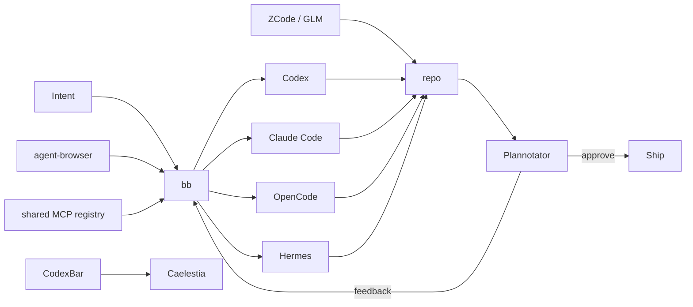

<div align="center">

# KRAKEN

### an agentic NixOS rice

**Hyprland · Caelestia · bb · Codex · Claude · OpenCode · Hermes · GLM**

A Linux workstation built around a simple loop:
**delegate → inspect → review → ship.**


</div>

---

Kraken is my daily NixOS workstation: a clean Hyprland rice where coding agents are part of the desktop instead of a pile of forgotten terminal tabs.

The rule is simple: **use cloud/provider agents where they are useful, keep the machine itself light.** There is no Ollama stack, local model daemon or GPU-burning local inference layer here.

## Desktop

| Layer | Choice |
|---|---|
| compositor | **Hyprland** |
| shell | **Caelestia / Quickshell**, patched by Nix |
| terminal | **Ghostty** |
| editor | **PychoVIM** + **Zed Preview** |
| browser | **Zen** + **Helium** + **Tor Browser** |
| music | **Spotify + Spicetify** |
| Discord | **Vesktop + system Vencord** |
| desktop AI | **ChatGPT Desktop** + **Claude Desktop** |
| agent IDEs | **bb** + **T3 Code** + **ZCode** |
| keyboard | **Turkish Q only** |

## Agent workflow



### The useful surfaces

- **bb** — primary control plane for Codex, Claude Code, OpenCode and Hermes threads/worktrees.
- **T3 Code** — lightweight GUI with Codex, Claude and OpenCode enabled together.
- **ZCode** — official GLM-focused agentic development environment, packaged from Z.AI's Linux AppImage and pinned by hash.
- **Plannotator** — visual review gate for Codex and Claude plans.
- **agent-browser** — browser automation without turning the desktop into a local-model lab.
- **CodexBar** — provider quota/reset state integrated directly into Caelestia.
- **ccusage** — local accounting of cloud-agent usage history; it does not run an LLM locally.

## Caelestia × CodexBar

Kraken does not start a second bar just for AI usage.

Caelestia is patched during the Nix build with a native `aiUsage` QML delegate. CodexBar refreshes provider pressure every 30 seconds; clicking it opens the Wayland GTK4 provider panel.

```text
╭─────────────╮
│    logo     │
│ workspaces  │
│ active app  │
│    tray     │
│   🤖 34%   ├──── click ──── CodexBar panel
│    clock    │
│   status    │
│    power    │
╰─────────────╯
```

No Waybar process, no copied shell scripts, no post-install patch step.

## Music

Spotify is managed through **Spicetify-Nix**. The Spotify package itself is supplied by the Home Manager module, so there is no duplicate client or installer.

Configured extensions:

- `adblockify`
- `hidePodcasts`
- `shuffle`
- Catppuccin Mocha theme

Music controls stay inside Caelestia's native MPRIS layer. Spotify is the default player, so the dashboard/Now Playing UI and the hardware media keys all control the same session.

> Spicetify and its extensions are community modifications and can break when Spotify changes its client.

## Discord

Discord runs through **Vesktop with Nix-managed Vencord** rather than patching the stock client after every rebuild.

Vesktop/Vencord configuration is written by Home Manager, app self-updates are disabled, and the Caelestia tray handles minimize-to-tray behaviour. This keeps the Wayland experience reproducible and leaves Discord one `Super + D` away.

> Vesktop/Vencord are unofficial Discord client modifications and may conflict with Discord's Terms of Service.

## Shortcuts

| Key | Action |
|---|---|
| `Super + Space` | Caelestia launcher |
| `Super + M` | Spotify |
| `Super + D` | Vesktop / Discord |
| `Super + Shift + D` | **bb** agent IDE |
| `Super + T` | T3 Code |
| `Super + Shift + G` | **ZCode / GLM** |
| `Super + Shift + H` | Hermes Desktop |
| `Super + U` | CodexBar provider panel |
| `Super + Shift + C` | Codex in Ghostty |
| `Super + Shift + O` | OpenCode in Ghostty |
| `Super + A` | ChatGPT Desktop |
| `Super + Shift + A` | Claude Desktop |
| `Super + N` | PychoVIM |
| `Super + Z` | Zed Preview |
| `Super + B` | Zen Browser |
| `Super + Shift + B` | Helium |

Everything is also discoverable from Caelestia's launcher. Keybinds are shortcuts, not required knowledge.

## Development baseline

The system is still a normal development workstation without an agent:

**Rust · Go · Python/uv · Node 24 · Bun · TypeScript · PHP/Composer · Java 21 · Lua · nixd · GCC/Clang · Podman · Distrobox · libvirt · Lazygit · mise**

**Bun is the JS package-manager baseline.** `pnpm` is intentionally not installed in the user environment. Node remains for runtime/LSP compatibility.

A Nix-native Apache + PHP + MariaDB stack replaces XAMPP and binds Apache to localhost only.

## Nix layout

```text
NixOS
├── shell
│   ├── Caelestia
│   ├── CodexBar QML integration
│   └── Spotify / MPRIS
├── desktop
│   ├── Zen + Helium
│   ├── Vesktop + Vencord
│   ├── ChatGPT + Claude
│   └── Spotify + Spicetify
├── agents
│   ├── bb → Codex / Claude / OpenCode / Hermes
│   ├── T3 Code
│   ├── ZCode / GLM
│   ├── Plannotator
│   └── agent-browser
└── host
    └── kraken
```

Most of the system is declarative. Two fast-moving user tools intentionally keep their upstream workflow:

- **PSYCHOVIM** owns its mutable Neovim config, marketplace and updater.
- **Zed Preview** follows the upstream Preview channel installer.

## Host

`kraken` is a Lenovo IdeaPad Gaming 3 16ARH7 with a Ryzen 5 6600H, Radeon 660M and RTX 3050 Mobile. AMD drives the desktop; NVIDIA is available through PRIME offload.

## Install note

> [!IMPORTANT]
> `hosts/kraken/hardware-configuration.nix` is intentionally a placeholder. Never reuse another machine's filesystem UUIDs.

After NixOS generates the real hardware configuration:

```bash
git clone git@github.com:OnurByte/nix-config.git ~/nix-config
cd ~/nix-config
sudo cp /etc/nixos/hardware-configuration.nix hosts/kraken/hardware-configuration.nix
sudo nixos-rebuild test --flake .#kraken
sudo nixos-rebuild switch --flake .#kraken
```

## Influences

Kraken started from ideas in [`bariscodefxy/nix-config`](https://github.com/bariscodefxy/nix-config), then moved toward its own direction: Caelestia's cohesive shell, Omarchy's application-first workflow and the restraint common in the better Hyprland/unixporn setups — **one shell, native media integration, a few strong shortcuts and as little glue code as possible.**

---

<div align="center">

**delegate fast · review visually · keep the desktop simple**

</div>
